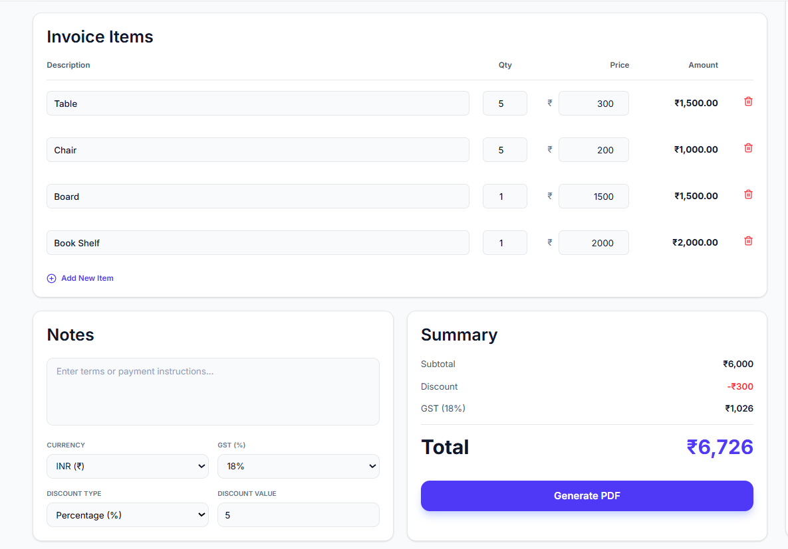
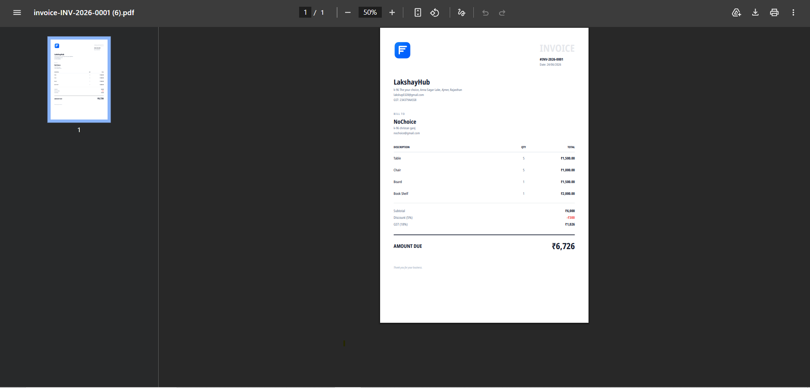

# Smart Invoice Generator

A modern, responsive invoice generation web application built with React that allows users to create professional invoices, calculate GST, apply discounts, preview invoices in real-time, and export them as PDF documents.

## 🚀 Live Demo

**Live Application:** https://invoice-generator-two-green.vercel.app

## 📸 Screenshots

<table>
  <tr>
    <td align="center">
      
      <br/>Dashboard
    </td>
    <td align="center">
      
      <br/>Item & Summary Cards
    </td>
  </tr>
  <tr>
    <td align="center">
      
      <br/>PDF Preview
    </td>
  </tr>
</table>

## ✨ Features

### Invoice Management

* Create professional invoices
* Auto-generated invoice numbers
* Business information management
* Client information management
* Company logo upload

### Dynamic Invoice Items

* Add unlimited invoice items
* Update quantity and pricing
* Remove items
* Automatic amount calculation

### Financial Calculations

* Automatic subtotal calculation
* GST/Tax calculation
* Percentage discount support
* Real-time total calculation
* Multi-currency support

### Invoice Preview

* Live invoice preview
* Professional invoice layout
* Responsive design
* Print-ready formatting

### PDF Export

* Export invoices as PDF
* Professional A4 layout
* Multi-page PDF support
* Company logo included in PDF

### User Experience

* Form validation
* Toast notifications
* Loading states
* Auto-save draft functionality
* Responsive design for mobile and desktop

## 🛠️ Tech Stack

### Frontend

* React.js
* Vite
* Tailwind CSS

### UI & Icons

* Lucide React
* Sonner (Toast Notifications)

### PDF Generation

* React PDF Renderer
* File Saver

### Utilities

* Local Storage API

## 📂 Project Structure

```bash
src
├── assets
│   └── Fonts   
│
├── components
│   ├── Navbar.jsx
│   ├── BusinessForm.jsx
│   ├── ClientForm.jsx
│   ├── InvoiceItems.jsx
│   ├── InvoiceNotes.jsx
│   ├── InvoiceSummary.jsx
│   ├── Footer.jsx
│   └── InvoicePreview.jsx
│
├── data
│   └── defaultInvoice.js
│
├── pdf
│   └── InvoicePdf.jsx
│
├── utils
│   ├── calculations.js
│   ├── currency.js
│   ├── generateInvoiceNumber.js
│   ├── pdfGenerate.jsx
│   └── validateInvoice.js
│
├── pages
│   └── Dashboard.jsx
│
└── App.jsx
```

## 🧮 Invoice Calculation Logic

### Subtotal

```javascript
Subtotal = Sum(Item Quantity × Item Price)
```

### Discount

```javascript
Discount Amount = Subtotal × (Discount % / 100)
```

### GST

```javascript
GST Amount = (Subtotal - Discount) × (GST Rate / 100)
```

### Total

```javascript
Total = (Subtotal - Discount) + GST Amount
```

## ⚙️ Installation

Clone the repository:

```bash
git clone https://github.com/Lakshay-hub-design/Invoice_generator.git
```

Navigate to project directory:

```bash
cd invoice-generator
```

Install dependencies:

```bash
npm install
```

Start development server:

```bash
npm run dev
```

Build for production:

```bash
npm run build
```

Preview production build:

```bash
npm run preview
```

## 📋 Validation Rules

* Company Name is required
* Business Email is required
* Client Name is required
* At least one invoice item is required
* Item description cannot be empty
* Quantity must be greater than zero
* Price cannot be negative
* Discount percentage cannot exceed 100%

## 🎯 Key Highlights

* Clean and modern UI
* Real-time invoice preview
* Dynamic GST calculations
* PDF export functionality
* Responsive layout
* Form validation
* Auto-save support
* Production-ready architecture

## 👨‍💻 Developer

**Lakshay Sharma**

* GitHub: https://github.com/Lakshay-hub-design
* Email: [lakshay0328@gmail.com](mailto:lakshay0328@gmail.com)

## 📄 License

This project was built as part of the Digital Heroes Frontend Development Trial Task.
